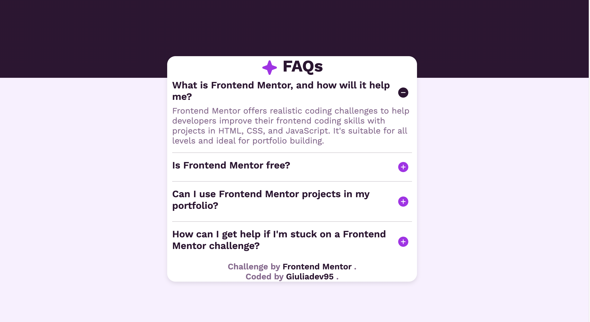

# Frontend Mentor - FAQ accordion solution

This is a solution to the [FAQ accordion challenge on Frontend Mentor](https://www.frontendmentor.io/challenges/faq-accordion-wyfFdeBwBz). Frontend Mentor challenges help you improve your coding skills by building realistic projects. 


## Table of contents

- [Overview](#overview)
- [Live Website](#live-website)
- [My process](#my-process)
  - [Built with](#built-with)
  - [What I learned](#what-i-learned)


## Overview

- This project focuses on responsive design with Bootstrap and accessibility. I used JavaScript to manipulate the DOM and enable the show/hide feature of FAQ answers.

Users should be able to:

- Hide/Show the answer to a question when the question is clicked
- Navigate the questions and hide/show answers using keyboard navigation alone
- View the optimal layout for the interface depending on their device's screen size
- See hover and focus states for all interactive elements on the page


## Live Website



- [See the live site URL here](https://responsivefaqaccordion.netlify.app/)


## My process

### Built with

- Semantic HTML5 markup
- CSS3 custom properties
- Flexbox
- [Bootstrap v5.3](https://reactjs.org/https://getbootstrap.com/)
- JavaScript
- Mobile-first workflow


### What I learned

1) Using JavaScript toggle() method to add classes to elements in the DOM on click.

```JavaScript
  const plus = document.querySelectorAll(".plus");
  const minus = document.querySelectorAll(".minus");
  const answer = document.querySelectorAll(".answer");

  plus.forEach((plus, index) => {
      plus.addEventListener("click", function showAnswer() {
          plus.classList.add("hide"); // add .hide class 
          minus[index].classList.add("show"); // add .show class 
          answer[index].classList.add("show"); // add .show class
    });
})
```

2) Proper use of the tabindex ="" ARIA attribute to optimize the website for screen readers navigation.

```html
  <p class="text-start answer" tabindex="0">
            The best place to get help is inside Frontend Mentor's Discord community. There's a help 
            channel where you can ask questions and seek support from other community members.
          </p>
```

3) Using Bootstrap for responsiveness.

4) Use the linear-gradient() CSS function to give the web page two background colors.

```css
  body {
    background: linear-gradient(180deg, hsl(292, 42%, 14%) 30%, hsl(275, 100%, 97%) 10%);
  }
```
